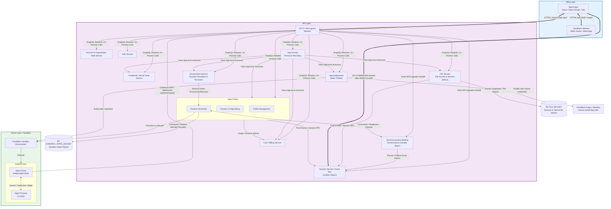
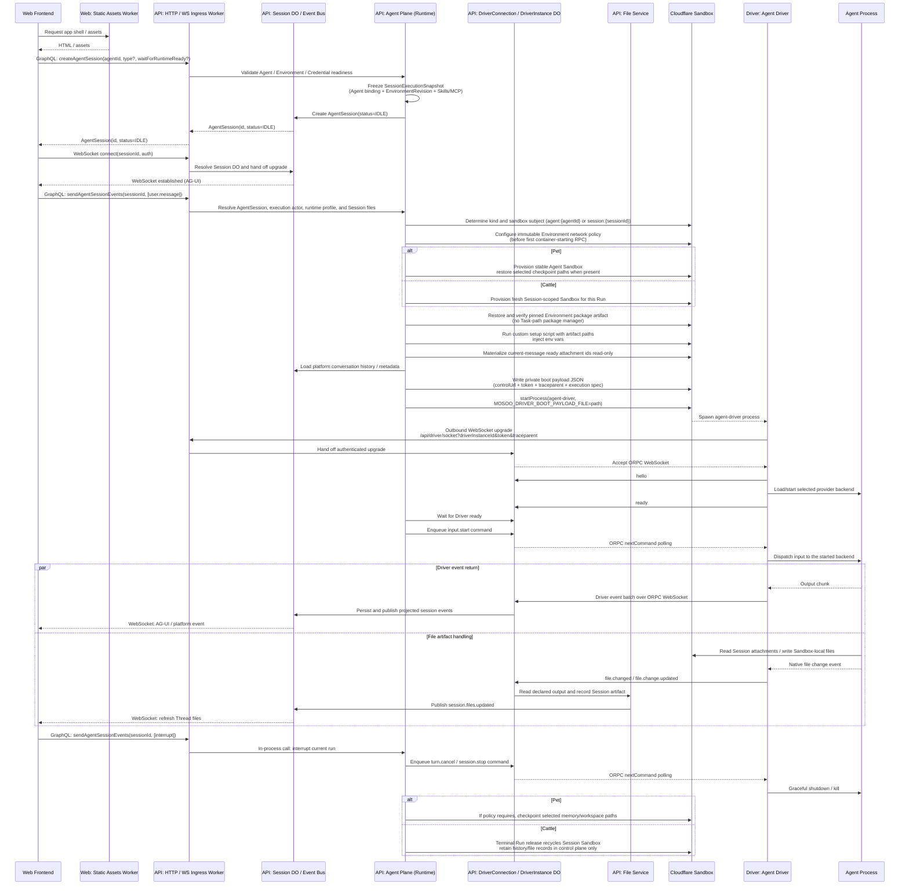

# Managed Agent Runtime Architecture

## 1. Vision And Principles

mosoo provides an App-scoped control plane for configuring, publishing, running, and observing coding Agents through the console and Public Thread API.

The product boundary is managed Agent execution. Builders keep ownership of their application and end-user authentication; a trusted backend supplies an opaque `userId`, and mosoo carries that immutable `(App, userId)` context across the public Thread, Runs, files, and delegated MCP calls. mosoo owns runtime adaptation, Sandbox lifecycle, durable Thread and Run records, managed files, credentials, events, and usage visibility. App Deployment is a separate Alpha surface and does not define the runtime or API contract. In the current construction phase, assume one human owns one Organization: Organization is the account / billing / tenant shell, and App is the code, data, product, and console boundary. App owns concrete resources directly; it does not introduce a generic Service entity, `services` table, or polymorphic `service.kind`. Additional operational controls are extension paths for the same architecture, not default complexity for the current community edition.

To support lightweight deployment, fast iteration, and future governance expansion, the architecture embraces Serverless and edge computing and follows these baseline principles:

- **Vectorized API design**: Core business APIs, especially northbound GraphQL, internal Worker RPC, and data mutation surfaces, should accept arrays of target entity IDs by default where it is natural. This reduces network round trips and gives the data layer room for batch writes and deletes.
- **Single ULID business identifier system**: The control plane, execution plane, internal RPC, and public APIs use server-generated ULIDs as canonical business and protocol identifiers. At persistence boundaries, ULIDs are stored and indexed as strings to preserve distributed generation performance and time-sortability.
- **Observability native**: mosoo emits Vestig structured logs and wide events, propagates W3C `traceparent` context across supported HTTP and Driver control boundaries, and enables Cloudflare Workers native logs and traces. Correlation is explicit at implemented boundaries; the architecture does not claim blanket OpenTelemetry instrumentation for database, queue, or Worker RPC calls.
- **Minimal Web / API / Driver topology**: The system is split by build and deployment boundary into three top-level planes: Web, API, and Driver.

---

## 2. Infrastructure

The architecture is built on the Cloudflare platform and uses a Serverless shape for elastic scaling:

- **Frontend and ingress: Cloudflare Workers**. The Web Worker serves Vite-built console assets. The API Worker handles stateless GraphQL / Web API requests and WebSocket handshakes, then hands upgraded session connections to the corresponding Session Durable Object. `mosoo.ai` is the marketing / landing / blog origin owned by `langgenius/mosoo-website`. Authenticated console traffic uses `cloud.mosoo.ai`, with Cloudflare routing `cloud.mosoo.ai/api/*` to the API Worker and console paths to the Web Worker. During the domain migration, console requests on `try.mosoo.ai` redirect permanently to the new host while `try.mosoo.ai/api/*` remains a direct API route for existing CLI credentials and webhooks.
- **State and connection management: Cloudflare Durable Objects**. Durable Objects hold upgraded WebSocket connections, high-frequency Session state, and distributed coordination points that need single-instance concurrency.
- **Primary database: Cloudflare D1**. D1 stores Account records, Organization shell records, App records, core entity configuration, and metadata.
- **Message queues: Cloudflare Queues**. Queues decouple the control plane from offline tasks. They provide ACK semantics, dead-letter queues, and at-least-once delivery for API commands (including deployment and scheduled maintenance) and Channel final delivery. Cost usage is written from normalized runtime events, not ingested through a queue.
- **Object storage: Cloudflare R2**. R2 stores session-level file objects,
  internal configuration/package uploads, any records using the reserved
  library scope, and sandbox state backups. Runtime-produced files are recorded
  as session artifacts. Sandbox private state backups use a separate backup
  bucket and must not be mixed with user-visible file prefixes.
- **Execution sandbox: Cloudflare Sandbox / Containers**. Heterogeneous Agents run in container-image-backed isolated environments, with Sandbox APIs and Durable Object boundaries controlling runtime lifecycle.
- **Secondary App deployment: mosoo-managed Cloudflare Pages / Workers**. App Deployment clones and builds a public GitHub repository in an isolated Sandbox, then publishes the resulting Web artifact with mosoo platform credentials. D1 stores the App-owned Deployment and DeploymentRun records, while the successful artifact receives a mosoo-owned URL. This is an independent Alpha capability, not App runtime or part of the core Agent API promise.
- **Configuration editing**. Owner-side Agent configuration is currently edited through Preview, which combines the writable configuration form with in-context test chat. There is no dedicated `AgentBuilderSystemAgent` topology in the current codebase. Future configuration assistance must remain a control-plane feature and must not enter the full Sandbox / Driver runtime path.

---

## 3. Topology

The system is split by logical and deployment boundary into three top-level domains: **Web Layer**, **API Layer**, and **Driver Layer**.

---

## 4. Layered Design

### 4.1 Web Layer

The Web layer provides the interactive client experience.

- It is built with **React / React Router / Vite** and served through Cloudflare Workers Static Assets on `cloud.mosoo.ai`.
- Browsers access a same-origin `/api/*` entry point from the console origin. Cloudflare routes `cloud.mosoo.ai/api/*` to the API Worker and console paths on `cloud.mosoo.ai` to the Web Worker, preserving independent Web/API deployments while keeping a same-origin product experience. `mosoo.ai` remains the marketing / landing / blog origin in the private website repository and sends login intent to the console origin. The legacy Web host preserves paths and query strings when redirecting; its `/api/*` route does not redirect across hosts because clients may drop authorization headers.
- WebSocket, using the `AG-UI WebSocket` protocol, carries bidirectional high-frequency streaming events such as text streaming and state synchronization.

### 4.2 API Layer

The API layer contains business logic, state management, and Agent scheduling. It is the system control plane.

Except for runtime boundaries such as Session Durable Objects and Sandbox instances, the API-layer `* Service` terms below refer to domain modules inside the same API Worker codebase, not independently deployed microservices. Product-level App resources are concrete nouns such as Agent, Channel, Environment, Skill, MCP server, file record, and Provider credential. V1 does not add a generic Service entity, `services` table, or polymorphic `service.kind`.

1. **API / WS Gateway**
   - Stateless Workers provide the shared HTTP and WebSocket ingress layer. They handle authentication, routing, GraphQL queries and mutations, and WebSocket handshakes.
   - WebSocket requests always enter the Worker first. Client session upgrades are handed to the corresponding Session Durable Object. An Agent Driver dials `/api/driver/socket` with its Driver instance id, one-time boot token, and trace context; the Worker validates and hands that upgrade to the `DriverConnection` binding backed by the matching `DriverInstance` Durable Object.

2. **App Domain**
   App Domain owns the business, resource, operations, and deployment boundary for the current pivot. App is the canonical product and engineering noun. An App belongs to an Organization and is owned by the Organization owner during the single-owner phase. App has no runtime; Agents own Agent runtime, API endpoint exposure, channel delivery, and Threads / Sessions. App Deployment owns an external Web artifact rather than an App runtime.
   - **Default App provisioning**: Onboarding / Organization provisioning creates a default App. If the Organization has exactly one App, the console routes directly into that App instead of forcing an App picker.
   - **Agent and resource ownership**: Agents, Threads / Sessions, Environments, Skills, MCP servers, Provider credentials, Channels, file records, Agent exposure state, App Deployments and DeploymentRuns, Agent runtime logs/state, and app-scoped cost are App-owned resources. The current UI keeps Agent logs/runtime operations on Agent detail and App Usage under App Settings; it does not expose a generic App health/log console.
   - **No generic Service entity**: Do not add a unified `services` table, polymorphic `service.kind`, or generic Service CRUD for concrete App resources. If a future Web/API runtime, database service, worker process, or scheduled job is needed, model it with an explicit noun and lifecycle.
   - **App Deployment**: One active Deployment per App records the public GitHub source and its DeploymentRuns. Build and publish work is asynchronous. Successful runs expose a mosoo-owned Cloudflare Pages or Workers URL under the configured App deployment domain. Users do not bring their own Cloudflare account in the current flow.
   - **Access boundary**: App access maps to the single Organization owner for this phase. No secondary principal model is part of the first cut.

3. **Agent Plane**
   The Agent Plane unifies configuration management, Preview configuration editing, and runtime scheduling. The public data entity is the bare `Agent`. Historical terms such as `AgentService` and `PublishedAgent` have been collapsed into `Agent`, and the module name `Agent Plane` avoids a naming collision with the entity itself.
   - **Profile management**: Agent definitions are stored under App in D1 and support CRUD plus import/export flows. The Profile manages Skill availability, MCP bindings, Runtime references, and Provider references for an App-local Agent. Runtime plaintext credentials are not stored in the Profile. New flows resolve them through Credential / Vault by `(execution_actor, app, provider)` and fail closed when App ownership cannot be proven. In the Runtime Session Kernel, the execution actor is the Agent owner; the caller is used only for ingress context and permission response attribution.
   - **Preview configuration editing**: Owner-side editing currently happens in Preview. The surface writes through Agent profile/configuration services, auto-saves eligible form fields, keeps pending changes explicit, and tests the saved or draft configuration through Preview chat. It is a user-facing edit/test surface, not a separate publishable Agent or system-assistant topology.
   - **Runtime**: The Runtime validates execution rights and orchestrates Cloudflare Sandbox instances. It writes a private Driver boot payload file, passes its path through `MOSOO_DRIVER_BOOT_PAYLOAD_FILE`, and starts `agent-driver`. The payload contains the API control URL, one-time boot token, trace context, Driver identity, frozen execution spec, and resolved Environment artifact paths. The Driver reads and removes that file, then actively dials the API control URL. The API's `DriverConnection` / `DriverInstance` Durable Object owns the authenticated ORPC WebSocket, command delivery, readiness, heartbeats, and Driver event ingestion. Runtime also applies Agent `kind` to choose Pet Sandbox or Cattle Session Sandbox behavior, restores the exact ready Environment package artifact before custom setup and Driver start, restores platform conversation history, materializes ready attachment ids explicitly submitted with the current message, records Session artifacts, and applies the limited checkpoint/restore and destruction policy below.
     - **Pet Runtime path**: A Pet Agent is bound to a stable Agent Sandbox with subject `agent:{agentId}`. Multiple Sessions for the same Pet happen inside the same Sandbox. The default initial working directory is shared, and Session-to-Session isolation is not guaranteed. Restart keeps the current container. Recreate/hibernate checkpoints only `/workspace/memory` plus eligible Session workspaces; login state, caches, vendor-native state, and other container-local files are not promised across rebuild. Reset agent-state destroys the current Pet container state but does not delete Agent config, Session history, Cost, logs, or control-plane file records.
     - **Cattle Runtime path**: Each Cattle Agent Session uses the isolated runtime subject `session:{sessionId}`. Each Run provisions a fresh Session Sandbox. The current policy closes the runtime conversation and immediately recycles that Sandbox when the Run becomes terminal; lifecycle cleanup can also destroy it. Temporary files, caches, login state, and native runtime state that are not explicitly captured as Session artifacts disappear with the Sandbox.
     - **Cattle continuation**: The product still allows continuing the same Cattle Session. The next `send events` Run creates a fresh Session Sandbox with the new input and only ready attachment ids explicitly referenced by that message. Platform history stays readable in the UI/DB, but the current Driver is not given a transcript replay or prior native state. Existing artifacts remain control-plane records and are not automatically restored; Cattle has no Backup/Restore target.
     - **Scaling extension point**: Runtime, Session Durable Object, and Driver contracts must not hard-code "single sandbox" as a permanent product fact. Pet may later add more stable Sandbox strategies under consistency constraints, and Cattle may later add standby pools or batch scheduling. The external API semantics remain governed by `kind`.

4. **File Service**
   The File Service is the storage boundary for shipped Session attachments/artifacts and internal file scopes. `library` exists as an App-scoped record type, but no current user-facing create/upload path makes it a shipped Files Library product:
   - **Abstraction and permission control**: Session, account, Agent-package, and Public API draft records are scoped implementation records. The reserved library scope is not an App source tree and does not revive the retired App Builder concept.
   - **Upload/download data plane**: Browser-side large uploads and downloads may use presigned URLs to avoid API memory pressure. Current user upload targets reject `library`; the Files page lists/downloads accessible records and runtime gets no shared writable library mount.
   - **Dormant library versioning**: Copy-on-write and `file_version` primitives exist for a future library write path, but no production UI/API currently reaches destructive library overwrite or move-overwrite. They are plumbing, not a shipped recovery guarantee.
   - **Session file resources**: Session File / Session Resource is the explicit attachment layer for files uploaded by a user or added through the Public API. The File Service stores them as `file_record(scope_kind=session, session_kind=attachment)` plus an R2 object, then injects a readable path manifest into the next Agent input. Session Files are not an automatic snapshot of the entire Session working directory, and Sandbox temporary files are not promoted into long-lived assets by default.
   - **Event flow**: Runtime-produced files are recorded as `file_record(scope_kind=session, session_kind=artifact)`. Frontend file events come from explicit Session file upload/delete actions and artifact updates, not from whole-working-directory snapshots.

5. **Environment Service**
   Environment is a first-class Agent runtime template asset. Like Agent, Skill, and MCP, new App work scopes it by App boundaries first.
   - **Data model**: `environment` stores environment asset metadata, owner, fork source, App scope, and `current_revision_id`. `environment_revision` stores immutable configuration versions, including `network_policy`, `allowed_hosts_json`, `packages_json`, `setup_script`, `env_vars_json`, `allow_package_managers`, and `allow_mcp_servers`. App points to its default environment; Organization does not provide a current runtime default.
   - **Defaults and reuse**: Each App has a system default environment. Users can create App-local Environments. Cross-App reuse is not part of the current control plane. Forking creates a new Environment identity and a new revision without mutating the source Environment.
   - **Runtime freeze**: An Agent references an `environment_id`. When a Session is created, Runtime resolves the current EnvironmentRevision and writes it into `session_execution_snapshot.plan_json`. The Session then always uses the environment id/name/revision/network/packages/setup/env vars snapshot captured there. Editing an Environment affects only future Sessions.
   - **Responsibility boundary**: Environment describes rebuildable runtime templates and startup constraints. It does not contain file records, Skill package content, MCP server definitions, or Session history. Exact `npm` and `pip` declarations are prepared asynchronously into App-scoped Cloudflare Sandbox Backups; custom setup scripts remain per-Sandbox actions. Historical `apt`, `cargo`, `gem`, and `go` values remain readable but cannot be written into a new revision or provisioned; owners receive an actionable migration error.
   - **Execution constraints (partial)**: Runtime restores and verifies the package Backup, exposes its executable/Python/Node paths to custom setup and Driver, then runs the custom setup script and injects env vars. The writable manager set is shared by Contracts, API validation, and Web, and is checked against the Driver image capability manifest. OS dependencies belong in the platform Driver image. `network_policy` and `allowed_hosts_json` are carried into `DriverProfileConfig.network`. `limited` is admitted only for Cattle / Task Agents whose Sandbox subject is session-scoped; Pet / Assistant Agents fail before provisioning because their stable shared subject can span Environment policies. For an admitted Cattle subject, Runtime persists a policy that is immutable for the subject lifetime before the container starts, disables direct container internet (`enableInternet=false`), and installs a deny-by-default allowlist containing the Environment hosts plus the control origin (Driver, MCP, and model-provider proxies) and R2 backup endpoint. The allowlist is evaluated at outbound HTTP/HTTPS interception, while direct non-HTTP egress remains disabled. Ordinary `HTTP_PROXY`, `HTTPS_PROXY`, and `ALL_PROXY` variables are rejected, and host-wide Runtime proxy bindings are not injected into `limited` sessions. A warm subject with unknown prior constraints fails closed and is destroyed rather than retaining broader raw TCP access; a different recorded policy fails closed even after a container restart. `full` keeps the Sandbox defaults, including the existing Pet behavior. Production pins HTTPS interception on; local workerd keeps it off for CA compatibility, so `limited` fails closed locally. `allow_package_managers` and `allow_mcp_servers` remain saved intent without runtime enforcement. Restore or setup failure must fail Session startup and enter Runtime diagnostics.

6. **Account & Organization Shell Service**
   - The current construction model is `Account -> Organization owner -> App`. Workspace and Team are not architecture concepts. For this phase, one human owns one Organization and App access maps to that owner.
   - Core identity entities remain `Account` and `Organization`; Organization is the account / billing / tenant shell for this cut. No invitation, request, role matrix, or lifecycle administration flow is part of the current App dependency graph.
   - Login selects the account's Organization shell, then routes to the default App when the Organization has exactly one App. The system no longer maintains `account.origin_organization_id` or an "Origin Org for life" concept.

7. **Auth Service**
   - Authentication is built on Better Auth. Supported authentication methods are **Google OAuth** and **Email OTP**. Both can create or sign in to the same email-backed Account; Email OTP is the fallback when Google is unavailable. mosoo has no password or password-recovery flow. Passkey (WebAuthn) is a planned future option but is not enabled in the current build.
   - The same verified email across providers maps to the same Account.
   - CLI and other programmatic clients authenticate through a device authorization flow, not a separate login method. `POST /api/auth/cli/start` returns a `device_code`, a short `user_code`, and a `/cli-auth` verification URI; the user confirms inside an authenticated web session via `POST /api/auth/cli/confirm`, and the client polls `POST /api/auth/cli/token` until it receives a one-time `Bearer` token. The issued token is a Personal Access Token, so CLI access reuses the Account identity already established by Google OAuth or Email OTP rather than introducing a new credential type.
   - The current version does not support passwords, magic links, federated identity, directory sync, domain-based routing, or invite/request flows. Post-auth resolver logic outside the single-owner App path is not part of V1.

8. **Session Service**
   - The Session Service is backed by Durable Objects, which own upgraded WebSocket connections.
   - It manages the conversation context between user and Agent and acts as the high-frequency event bus. It receives events from Runtime and File Service, then broadcasts them to connected clients. Session Durable Objects do not perform gateway handshake responsibilities; ingress and handoff stay in the Worker.

9. **Credential / Secret Vault Service**
   - Provider keys, API keys, and MCP credentials are App-scoped for current App work. Runtime resolves the active key by `(execution_actor, app, provider)` and fails closed when the App-scoped credential cannot be proven. In Agent execution, the execution actor is the Agent owner; the caller is used only for ingress context.
   - API keys, provider keys, MCP access credentials, and App Deployment secret values are encrypted at rest with envelope encryption. Plaintext exists only briefly at the owning execution boundary. Profiles and deployment metadata store references and names, never plaintext secrets.
   - App Deployment secrets are owner-managed and App-scoped. The deployment manifest may declare required names but never values; values are resolved after repository planning and are sent only as Cloudflare Worker `secret_text` bindings, never to the build Sandbox, generated config, plans, logs, GraphQL reads, or public App code.
   - Provider model calls authenticate through the Worker-side LLM proxy (`/api/driver/llm/proxy/:credentialId/*`). The Sandbox receives only an expiring, driver-generation- and model-bound `llm_proxy` grant in the vendor key env var and the proxy endpoint in the vendor base-URL env var (or rendered OpenCode config); the Worker verifies the active driver generation, admits only the model protocol's required endpoints, reads the vault secret per forwarded request, and injects the vendor auth header upstream. Raw provider keys never enter the Sandbox boot payload, process environment, or setup script environment.
   - Credential CRUD, active key switching, and Agent / MCP binding changes are control-plane changes. High-frequency `resolveCredential()` calls are runtime reads and remain outside mutation workflows.

10. **Cost / Billing Service**
    - Cost and billing data are recorded as a usage ledger. The current schema uses `usage_event` and `usage_daily_rollup`, with dimensions such as `organization_id`, `app_id`, `agent_id`, `actor_user_id`, `agent_owner_user_id`, `session_id`, `session_run_id`, provider, model, runtime id, run purpose, token buckets, pricing status, and usage contract. App is the primary business-cost dimension; Organization remains the billing rollup.
    - Runtime model-call events are normalized before they enter the cost service. The cost service consumes already-normalized usage and does not infer provider-specific token semantics itself.
    - Cost records usage in its own ledger and does not reuse Runtime Log, traces, or structured application logs as billing data.

### 4.3 Driver Layer

The **Agent Driver** is a top-level independently built execution component because it runs inside heterogeneous Cloudflare Sandbox environments and must stay small and clean.

> **Terminology lock**: In this architecture, **`Agent Driver`** is the canonical name for the driver process, capability registration, upstream event envelopes, and downstream vendor protocol adaptation. Vendor-specific implementation inside the Driver is called **Driver backend** or **vendor-specific backend**. Historical terms such as `VendorAdapter`, `runtime adapter`, `Driver adapter`, `Provider Adapter`, and `Runtime Driver` should be normalized to `Agent Driver` or `Driver backend`. `Runtime` means API/control-plane scheduling, lifecycle, and Sandbox orchestration. `Provider` means the model and credential provider dimension.

1. **Agent Driver**
   - The Driver is a minimal independently built binary or script entry point. Runtime starts it explicitly inside the Sandbox and treats it as the long-lived control process.
   - **Current public Driver types**: The API/Web Runtime Catalog exposes `openai-runtime`, `claude-agent-sdk`, and the `acp-fallback` transport (labeled `OpenCode`) to users. The standalone Driver registry independently maps those runtime/transport pairs to executable backends and advertised capabilities; the main repository's cross-submodule test requires both registries to match. The OpenAI runtime path uses an app-server / SDK backend. The Claude path uses the native Claude Agent SDK interface. The `acp-fallback` path serves OpenCode and DeepSeek configurations through ACP.
   - **Current internal catalog placeholder**: `system-agent` exists only as an
     internal/disabled Runtime Catalog entry. It is not Driver-admitted, not a
     Driver protocol runtime, and not user-selectable. New provider integrations
     must add a real Driver backend and declare capabilities and gaps in Runtime
     Catalog before admission.
   - **Boot configuration injection**: Runtime writes the complete boot payload to a private Sandbox file and passes the file path through `MOSOO_DRIVER_BOOT_PAYLOAD_FILE`. The payload carries `controlUrl`, a one-time boot token, `traceparent`, Driver identity, and the frozen execution spec. The Driver removes the file after reading it. mosoo's runtime path does not send this configuration through standard input.
   - **Control flow establishment**: The Driver does not listen on a sandbox-local control port. It actively opens an authenticated WebSocket to the payload's `controlUrl`, currently `/api/driver/socket`. The API Worker hands the upgrade to the `DriverConnection` binding, whose `DriverInstance` Durable Object owns the socket and ORPC command/event lifecycle. Runtime talks to that Durable Object for readiness, commands, status, and cleanup. Protocol v1 still carries a required `driverControlPort` field for legacy diagnostics, but neither side binds that port and new integrations must not depend on it; removal needs a versioned API/Driver rollout. Authentication, routing, App access checks, and asset boundaries remain in Worker / Runtime.
   - **Multi-Session isolation**: `AgentSession` is the product-level conversation boundary. Cloudflare Sandbox and container processes are execution resource boundaries. If multiple long-lived Driver / Agent processes in one Sandbox need stronger process, filesystem, or environment isolation, evaluate user-space container tooling such as `bubblewrap` inside the container for narrower per-session namespaces.

2. **Agent Process**
   - **Protocol adaptation**: The Driver encapsulates native integration details for OpenAI runtime app-server, Claude Agent SDK, and required vendor CLI / SDK paths. This adaptation is internal to the Driver and is not an independently deployed topology node.
   - **Target process**: The Agent Process performs model reasoning, code generation, or CLI work. The Driver launches, supervises, and reaps it.

---

### 4.4 Configuration Assistance Boundary

The current product does not ship a dedicated lightweight System Agent or Agent Builder system-assistant topology. Owner editing starts from a blank Agent when needed, opens Preview, and uses the same Preview form/test surface to configure and validate behavior.

Future configuration assistance is allowed only as a control-plane capability layered over App / Agent form state. It must not be modeled as a user-publishable, shareable, long-running business Agent, and it must not enter the full Sandbox / Driver runtime path.

Design constraints for any future assistant:

- **No full Agent Runtime**: It must not create Runtime `AgentSession` or Sandbox execution resources, start Agent Driver, consume Pet/Cattle Sandbox paths or caches, or write Session artifacts.
- **Form-visible writes**: Generated changes must be represented as visible form values or reviewable diffs before persistence.
- **Control-plane tools only**: Tools should call existing App, Agent profile/configuration, Vault, File, Environment, and Permission services. They must not bypass domain services to operate directly on D1 or R2.
- **Canonical configuration stays in domain storage**: App and Agent configuration remains in D1, R2, and domain services. Any assistant state is context, not the source of truth.
- **Explainable and rollback-safe failure**: Real configuration mutation must show a diff, run permission checks, and run schema validation first. Write failures must not silently fall back.

---

### 4.5 Agent Sandbox And Persistence Layers

An Agent's runtime filesystem must not be treated as a generic workspace. The architecture first separates Sandbox lifecycle by Agent `kind`, then separates the reserved App library scope, platform Session history, Session artifacts, and disposable cache. The principle is: **file records are control-plane data; Sandbox is an execution environment; Session history/artifacts are session data; they must not impersonate each other**.

| Layer                        | Applies To   | Lifecycle                                                                                                                                                                                                                                                                                                                                                                                                                                                     | Typical Content                                                                                 | Canonical Owner                                                          |
| ---------------------------- | ------------ | ------------------------------------------------------------------------------------------------------------------------------------------------------------------------------------------------------------------------------------------------------------------------------------------------------------------------------------------------------------------------------------------------------------------------------------------------------------- | ----------------------------------------------------------------------------------------------- | ------------------------------------------------------------------------ |
| **Pet Sandbox**              | Pet          | Stable Agent-level Sandbox, subject `agent:{agentId}`. Multiple Sessions share one Sandbox by default. Restart retains the container; recreate/hibernate checkpoints only `/workspace/memory` and eligible Session workspaces.                                                                                                                                                                                                                                | Container-local login/cache/native/files; only selected memory/workspace paths are checkpointed | Live Sandbox container + selected backup paths + runtime metadata        |
| **Cattle Session Sandbox**   | Cattle       | Isolated Sandbox addressed by the Session-level subject `session:{sessionId}`. A fresh Sandbox is provisioned for each Run and immediately recycled after terminal Run release.                                                                                                                                                                                                                                                                               | Temporary files, build artifacts, caches, login state, vendor-native state for one Run          | Runtime temporary resource; not persistent between Runs                  |
| **Reserved library scope**   | Pet / Cattle | App-scoped `library` record/versioning plumbing. The current HTTP API rejects library upload and the Files page has no create/upload action, so it is not yet a user-managed product surface or runtime input.                                                                                                                                                                                                                                                | No shipped user-created content path                                                            | Reserved `file_record(scope_kind=library, scope_id=appId)` + FILE_BUCKET |
| **Session File / Resource**  | Pet / Cattle | Explicit attachment set for a product Session. Web Session upload creates it directly; Public API Agent upload first creates an internal App draft, then a Thread resource reference claims it into the Session. Public claim and delete/remove enforce the same writable-lifecycle projection: archived, rescheduling, and terminal Sessions remain readable but reject file mutation. Session deletion hard-deletes file objects and control-plane records. | Files uploaded for the current Session, Public API Thread attachments                           | FILE_BUCKET + `file_record(scope_kind=session, session_kind=attachment)` |
| **Platform Session History** | Pet / Cattle | Product Session data persisted by Session Durable Object / API for control records and UI replay. It is not the Sandbox filesystem and is not injected as transcript replay into a fresh Cattle Driver.                                                                                                                                                                                                                                                       | Transcript, event metadata, run state, ingress context                                          | D1 / Session storage / Runtime metadata                                  |
| **Sandbox Cache**            | Pet / Cattle | Disposable and rebuildable. Environment changes or Sandbox rebuilds rematerialize it from EnvironmentRevision.                                                                                                                                                                                                                                                                                                                                                | Package cache, setup script artifacts, rebuildable tool cache                                   | Environment / Runtime provisioning cache                                 |

Invariants:

- **Pet continuity is bounded**. The live container survives restart, while
  recreate/hibernate restores only `/workspace/memory` and eligible Session
  workspaces. Reset destroys container state. Agent config, control-plane file
  records, Session history, Cost, and logs remain control-plane data.
- **Cattle isolation comes from a fresh Sandbox per Run under a Session-scoped subject**. Cattle has no Agent-level stable Sandbox state. Terminal Run release immediately recycles the Sandbox; temporary files, caches, login state, and native state disappear unless they were recorded as Session artifacts.
- **Cattle continuation is not old-Sandbox reuse**. Continuing a product Session creates a fresh Sandbox with platform conversation history. Only current-message attachment references are materialized; Cattle does not restore Backup content or every linked file/artifact.
- **The library scope is not shipped as a write surface**. Current user uploads
  cannot target it, and runtime output becomes a Session artifact instead.
- **Session File is the explicit Session attachment layer**. A ready file is exposed to the Agent only when its id is included with the current input. It does not promise automatic injection of all linked files or restoration of the whole Sandbox working directory.
- **Session history is not file storage or Sandbox backup**. Transcript and metadata are used for interaction context and UI replay. They do not automatically make Sandbox-local files long-lived assets.
- **Environment cache is not state**. It contains rebuildable packages and setup artifacts. It does not create durable file records and is not a user-visible asset promise.
- **Permission checks happen on both control-plane and Driver-guard sides**. Session creation freezes runtime profile inputs, and recovery/continuation paths must not bypass current permissions.

---

## 5. Core Execution Flow

---

## 6. References

### Product Documents

- `Credentials PRD`: [`credentials.md`](./prd/credentials.md)
- `Files API PRD`: [`files-api-contract.md`](./prd/files-api-contract.md)
- `Public Thread API`: [`public-thread-api-surface.md`](./prd/public-thread-api-surface.md)
- `Thread Files`: [`session-files.md`](./prd/session-files.md)
- `Session Lifecycle PRD`: [`session-lifecycle.md`](./prd/session-lifecycle.md)
- `Runtime Session Kernel PRD`: [`runtime-session-kernel.md`](./prd/runtime-session-kernel.md)
- `Environment PRD`: [`environment.md`](./prd/environment.md)

### External Protocols And Platforms

- `ULID`: <https://github.com/ulid/spec>
- `GraphQL`: <https://github.com/graphql/graphql-spec>
- `AG-UI`: <https://github.com/ag-ui-protocol/ag-ui>
- `OpenAI runtime App Server`: <https://developers.openai.com/>
- `Skill`: <https://github.com/anthropics/skills>
- `MCP`: <https://github.com/modelcontextprotocol/modelcontextprotocol>
- `Cloudflare Sandbox`: <https://developers.cloudflare.com/sandbox/llms.txt>
- `bubblewrap`: <https://github.com/containers/bubblewrap>
